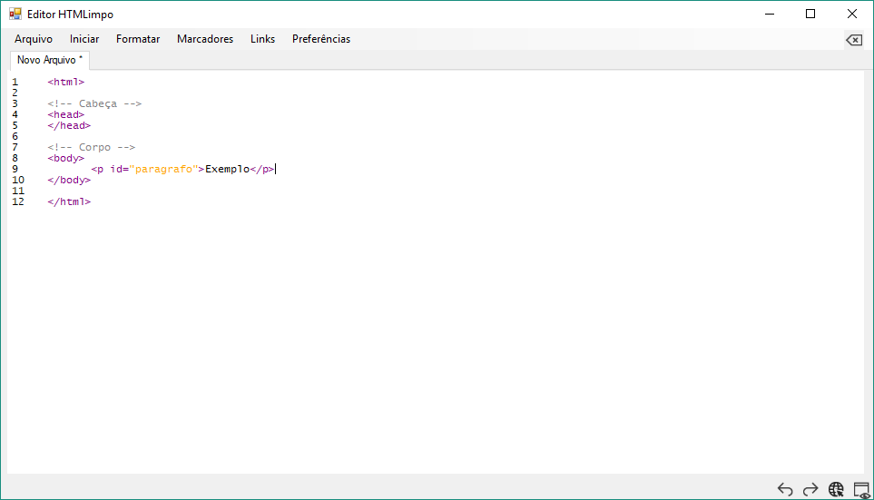
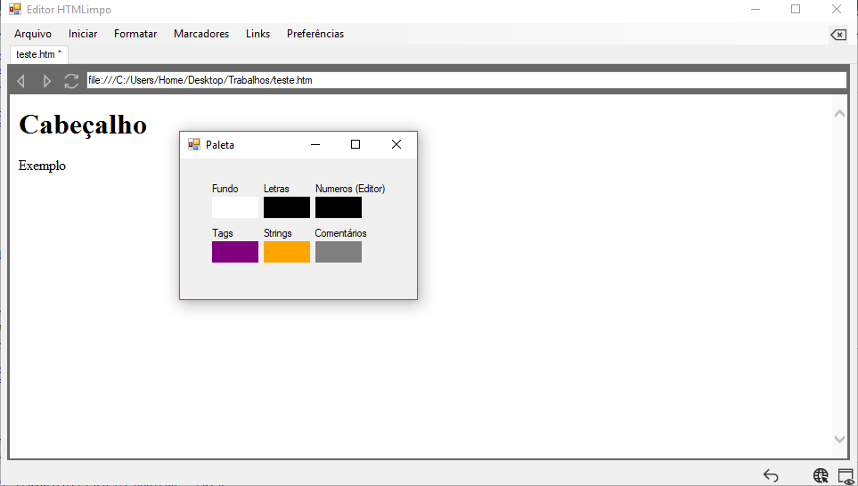

# Editor-HTML-Simples
Editor simples de HTML construido em VisualBasic (Projeto escolar)  
WindowsApplication1/Form1.vb

## Funcionalidades
 * Colorização (personalizável):
   - Tags
   - Strings
   - Comentários
 * Pré-visualização do conteudo (Preview)
 * Abas múltiplas
 * Inserção de código HTML - `<b>`, `<i>`, ``, `<a>`, `...` html
 * Inserção de código CSS (em spans) - `color`, `font`, `...` css
  
## Menus
 * Arquivo
   - Novo *Ctrl+N* 
   - Abrir *Ctrl+O*
   - Salvar *Ctrl+S*
   - Salvar como... *Ctrl+Shift+S*
   - Fechar
 * Iniciar
   - Parágrafo html
   - Salto de Linha html
   - Figuras e Imagens html
 * Formatar
   - Centralizar css
   - Negrito *Ctrl+B* html
   - Sublinhado *Ctrl+U* html
   - Italico *Ctrl+I* html
   - Fonte css
   - Cor de Fundo css
 * Marcadores
   - Ordenados *Ctrl+L* html
   - Não ordenados *Ctrl+Shift+L* html
 * Links
   - Inserir html
 * Preferências
   - Paleta de Cores
   
## Botões
 * Fechar guia
 * Undo (Desfazer) *Ctrl+Z*
 * Redo (Refazer) *Ctrl+Y*
 * Abrir no Navegador Padrão
 * Pré-visualizar
   
## Interface
### Janela Principal

### Preview e Paleta

